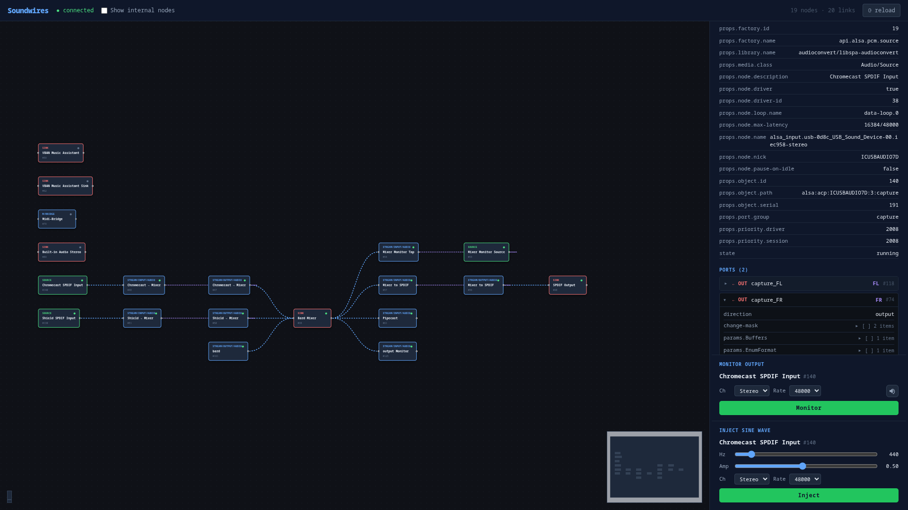

# soundwires

A read-only PipeWire graph visualizer for headless Linux servers. Drop a single static binary onto the box, point a browser at it, and see what your audio graph actually looks like — plus check whether audio is flowing through it.



## Why

PipeWire is great, but on a headless server (think: an audio appliance, a streaming box, a Raspberry Pi running a studio rig) there's no easy way to inspect the graph. The usual answers — [Helvum](https://gitlab.freedesktop.org/pipewire/helvum) and [coppwr](https://github.com/dimtpap/coppwr) — are GUI apps that need a desktop session.

soundwires fills that gap:

- **Graph visualization in a browser.** Nodes, ports, and links rendered as an interactive graph, accessible from anywhere on the network.
- **Signal probing.** Inject a sine wave into any input port, or tap any output port and watch a level meter, to confirm audio is actually moving through the graph.
- **Single static binary.** No runtime dependencies beyond the PipeWire CLI tools (`pw-dump`, `pw-cat`, `pw-link`) that already exist on any PipeWire host. `scp` it, run it, done.
- **Read-only by design.** Unlike coppwr/Helvum, soundwires deliberately does *not* let you edit the graph. It's a diagnostic tool, not a patchbay — safe to leave running on production systems.

Inspired by Helvum (graph layout) and coppwr (object detail inspection), but scoped down to "see and probe, don't touch."

## Install

Prebuilt binaries are produced by `make build` for amd64, armhf, and arm64:

```
make build
```

Outputs land in `bin/`. Copy the appropriate one to your target:

```
scp bin/soundwires-arm64 pi@audiobox:/usr/local/bin/soundwires
```

Or `go install` for the host arch:

```
make install
```

## Run

On the target server:

```
soundwires
```

Then open `http://<host>:8080` in a browser.

### Flags

```
  -p, --port int         HTTP port to listen on (default 8080)
  -H, --host string      bind address (default "0.0.0.0")
  -i, --interval int     PipeWire poll interval in milliseconds (default 500)
      --pw-dump string   pw-dump binary path (default "pw-dump")
      --pw-cat string    pw-cat binary path, used for record and playback (default "pw-cat")
      --pw-link string   pw-link binary path (default "pw-link")
```

### Requirements on the target

- A running PipeWire session
- `pw-dump`, `pw-cat`, `pw-link` on `PATH` (or pointed at via flags)

The binary itself is statically linked (`CGO_ENABLED=0`), so there's no glibc/musl concern.

## Development

```
make dev-go    # backend on :8080, serves the last `make build`'d frontend
make dev-web   # Vite dev server with HMR
```

Stack: Go backend wrapping `pw-dump`/`pw-cat`/`pw-link`, WebSocket push of graph state, Vue 3 + [Vue Flow](https://vueflow.dev/) frontend. The frontend is embedded into the Go binary via `go:embed`.

## License

MIT
